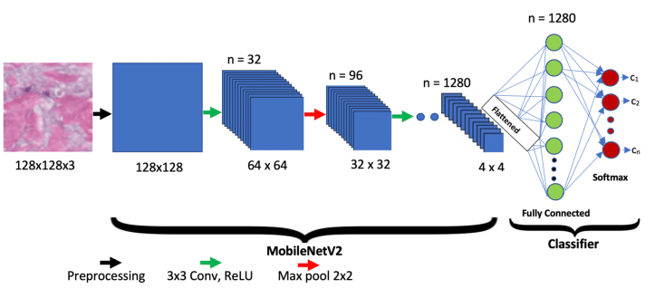

## ✨ BirdKlazzz: Klasifikasi Otomatis Jenis Ternak Burung Hias dengan ResNet50 dan MobileNetV2 ✨

  

## Deskripsi Proyek
Proyek ini bertujuan untuk mengembangkan sebuah sistem klasifikasi gambar yang dapat mengenali dan membedakan jenis burung hias ternak menggunakan teknik ResNet50 dan MobileNetV2. Dataset yang digunakan mencakup 25 spesies burung, menyediakan tantangan menarik untuk membangun model klasifikasi yang akurat dan aplikatif dalam industri ternak burung hias. Sistem ini diharapkan dapat mempermudah peternak burung hias dalam mengidentifikasi spesies burung secara otomatis melalui gambar, sehingga meningkatkan efisiensi dalam pengelolaan ternak.

**Link Dataset yang digunakan:** [25 Indian Bird species with 22.6k images](https://www.kaggle.com/datasets/arjunbasandrai/25-indian-bird-species-with-226k-images). 
Preprocessing yang digunakan antara lain Resizing, Normalization dan Augmentation.

Model yang digunakan: Pre Trained Model ***ResNet50***  dan Pre Trained Model ***MobileNetV2*** dengan Architecture Model kurang lebih seperti gambar berikut.

**ResNet50** ✨

**MobileNetV2 Architecture** ✨

## Overview Dataset
Dataset ini awalnya terdiri atas 22.6 ribu gambar dari 25 spesies burung (berbagai gambar RGB) [berikut] (https://www.kaggle.com/datasets/arjunbasandrai/25-indian-bird-species-with-226k-images), namun setelah dilakukan proses seleksi dan pengaturan, jumlah data yang digunakan untuk pelatihan telah dibatasi menjadi sekitar 3698 gambar. Dataset ini telah dibagi dengan rapi dan disesuaikan untuk keperluan klasifikasi burung hias ternak, sehingga dapat digunakan secara efektif dalam pengujian dan pelatihan model klasifikasi.  Data yang terbagi menjadi 70% sebagai *Training Set*, 20% sebagai *Validation Set*, dan 10% sebagai *Testing Set*, dimana pada setiap Set, terdapat 4 Label Class Label Class yaitu: *Common Kingfisher*, *Gray Wagtail*, *Hoopoe*, *House Crow*.
 
## Langkah Instalasi

a. Model 
1. Unduh Dan Ekstrak Dataset
2. Run Script Settings To Extracted Dataset (Script.ipynb)
3. Run UAP_BURUNG_SMALL_MOBILENETv2.ipynb
4. Run UAP_BURUNG_SMALL_ResNet50.ipynb
5. Save Kedua Model

b. Streamlit
1. Clone Project Ini
2. PDM : [Dokumentasi PDM](https://pdm-project.org/)
3. PDM init 
4. PDM add tensorflow numpy streamlit
5. Run app.py melalui localhost

c. Deploy Streamlit Model
1. Upload All File Diluar Environtment PDM (.gitignore)
2. Deploy dan Bake melalui streamlit dengan terhubung dengan github[Dokumentasi Streamlit](https://docs.streamlit.io/)
3. Run dengan address deployment dengan akhiran **.io**

## Deskripsi : Model, Hasil, Analisis

**Preprocessing**

- Generator training menggunakan ImageDataGenerator untuk memuat dan memproses gambar dari direktori yang ditentukan.
- Gambar diubah ukurannya menjadi 224x224 piksel dengan batch size 64.
- Augmentasi data diterapkan pada gambar training dengan langkah-langkah berikut:
    - Rescaling nilai piksel ke rentang [0, 1].
    - Rotasi acak hingga 30 derajat.
    - Flip horizontal secara acak.
    - Fill mode untuk mengisi piksel yang hilang akibat transformasi.
- Untuk validation dan test, hanya dilakukan rescaling tanpa augmentasi untuk menjaga integritas data.
- Konfigurasi ini memungkinkan model untuk belajar dari berbagai variasi gambar selama training, sementara preprocessing untuk evaluasi tetap konsisten.

### ResNet50 : Modelling & Evaluation ✨

Model ini menggunakan ResNet50 sebagai base model yang telah dilatih dengan ImageNet dan dibekukan untuk ekstraksi fitur. Arsitektur terdiri dari Global Average Pooling, lapisan dense dengan 256 unit (ReLU), Dropout sebesar 0.3, dan lapisan output dengan 4 unit (Softmax). Total parameter: 24,113,284, dengan 525,572 parameter dapat dilatih. Konfigurasi ini memanfaatkan keunggulan ResNet50 untuk ekstraksi fitur dan lapisan tambahan dilatih untuk klasifikasi burung hias.
Hasil dari model ResNet50 yang telah dibangun adalah sebagai berikut :

Berikut hasil dari Model setelah dilakukan *Fine-Tuning* menggunakan dataset RPS ::

a. Plot di atas menunjukkan bahwa training accuracy meningkat bertahap hingga **53%,** sementara validation accuracy fluktuatif namun meningkat hingga **60%.**
b. Plot di atas menunjukkan bahwa training loss menurun dari **1.5** ke **1.1**, sedangkan validation loss fluktuatif namun menurun hingga sekitar **1.05**, menunjukkan model kemungkinan underfitting.

Gambar di atas menunjukkan Classification Report dari model ResNet50 setelah prediksi pada Testing Set. Model mencapai akurasi keseluruhan sebesar **61%** dengan skor presisi, recall, dan f1-score yang seimbang pada empat kelas: Common Kingfisher, Gray Wagtail, Hoopoe, dan House Crow. Hasil ini menunjukkan kemampuan model dalam mengenali pola pada data burung hias dengan tingkat generalisasi yang cukup baik.

### MobileNetV2 : Modelling & Evaluation✨

Model ini menggunakan MobileNetV2 sebagai base model yang telah dilatih dengan ImageNet dan dibekukan untuk ekstraksi fitur. Arsitektur terdiri dari Global Average Pooling, lapisan dense dengan 256 unit (ReLU), Dropout sebesar 0.3, dan lapisan output dengan 4 unit (Softmax). Total parameter: 2,586,948, dengan 328,964 parameter dapat dilatih. Konfigurasi ini menggabungkan keunggulan MobileNetV2 dengan lapisan kustom untuk klasifikasi burung hias.
Hasil dari model MobileNetV2 yang telah dibangun adalah sebagai berikut :

Berikut hasil dari Model setelah dilakukan *Fine-Tuning* menggunakan dataset tersebut:

a. Plot di atas menunjukkan bahwa training acc stabil di atas 98%, sedangkan validation acc konsisten tinggi di rentang 96 hingga 98%.
b. Plot menunjukkan training loss stabil di sekitar 0.03 hingga 0.08, sedangkan val_loss konsisten rendah di rentang 0.07 hingga 0.12.

Gambar di atas menunjukkan Classification Report dari model ResNet50 setelah prediksi pada Testing Set. Model mencapai akurasi keseluruhan sebesar 97% dengan skor presisi, recall, dan f1-score yang tinggi pada empat kelas: Common Kingfisher, Gray Wagtail, Hoopoe, dan House Crow. Hasil ini menunjukkan performa model yang sangat baik dalam mengenali dan mengklasifikasikan gambar burung hias dengan tingkat generalisasi yang sangat tinggi.

## Link Live Demo

[Link Live Demo : UAPBURUNG514.streamlit.app](https://uapburung514.streamlit.app/)

### Tampilan HomePage & Upload Image

### Tampilan Prediction Result

## Author 👨‍💻

- [@HaidarZ](https://github.com/hazarddrips)